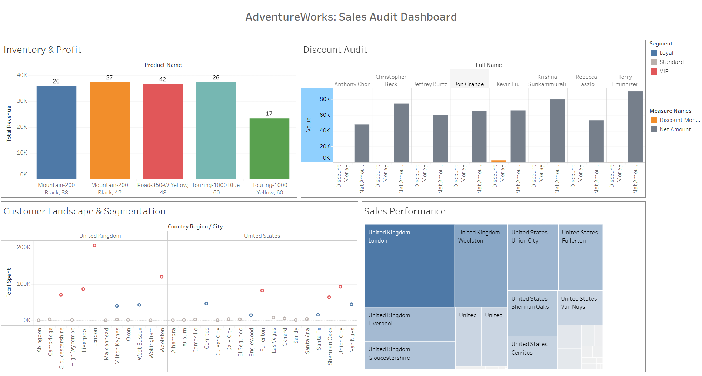
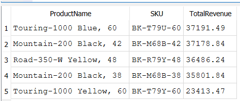
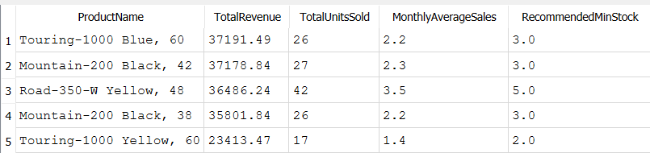
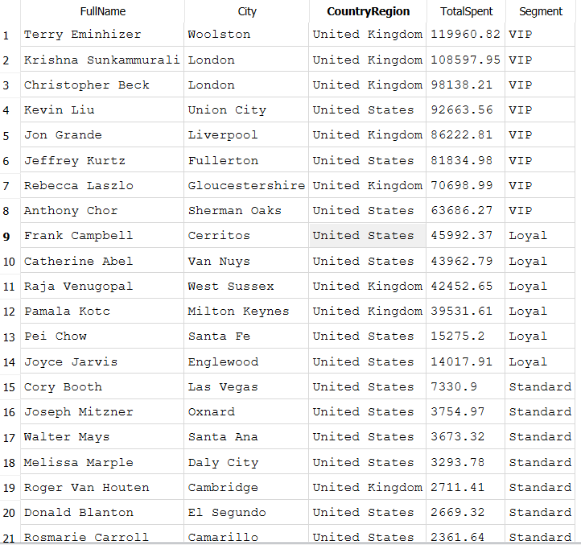
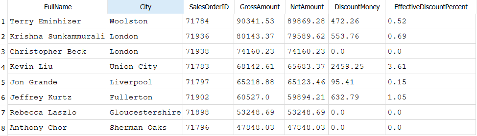

# Sales and Product Analysis: Insights from AdventureWorks Cycles

This project focuses on a comprehensive analysis of AdventureWorks' business metrics. Using SQL queries against an SQLite database, I examined the sales structure, identified the most profitable regions, and created a VIP client profile for optimizing business strategy.

---

## Business Problem & Goals

1. Identify the top 5 products by gross profit and check  their inventory levels.
2. Identify clients in the “VIP” segment and describe their average bill and average number of orders.
3. Identify the sales region that has the highest average order value, but also the lowest repeat purchase rate.
4. Determine the effectiveness of the promotion.

## Data Sources & Tech Stack

Sources: 

- This project is based on the AdventureWorksLT sample database, provided by Microsoft for educational purposes.
  https://learn.microsoft.com/en-us/sql/samples/adventureworks-install-configure?view=sql-server-ver17&tabs=ssms
- The SQLite database file was obtained from the open GitHub repository:
  https://github.com/martinandersen3d/AdventureWorks-for-SQLite/tree/master

Tech Stack:

- Database: SQLite
- Tools: DB Browser for SQLite/SQL
- Visualization: Tableau

## Project Workflow & Key insights

1. Product profitability analysis and inventory recommendations.
   I identified the top 5 revenue-generating products. Since the database lacked current inventory data, I applied an analytical approach.

   • Insight: Top-performing items generate between $23,000 and $37,000 in revenue.
   
   • Recommendation: Set safety stock at 1.5 times average monthly sales to avoid shortages of top-selling items.

3. VIP Client Segmentation
   Analysis showed that 80% of revenue is generated by a small group of 8 VIP clients.
   
   • Anomaly: A 100% single-purchase rate was identified. Clients make one large purchase but do not return.
   
   • Most high-value purchase: A client from Woolston with a transaction valued at 119,960.

3. Geographic Profile
   Key Profit Centers:
   
   • London: Hub of loyal customers willing to pay full price.
   
   • Woolston: Location of the largest check in the company.

5. Discount Policy Audit
   I conducted a detailed recalculation of the "effective discount rate" to eliminate mathematical anomalies.

   • Kevin Liu's Case: With an average percentage of 0.8%, the actual discount in monetary terms was 2,459.25. This confirms the use of deep discounts on individual items within the receipt.
   
   • Conclusion: Most VIP clients purchase products with minimal discounts (<1%), indicating a high value for the product.

## Final Recommendations

1. Retention: Implement a promo to stimulate our current customers to make a second purchase and build a re-purchase relationship for the future. As the current model is too reliant on one-off 'giant' transactions.
2. Pricing: Keep the maximum discount level for new huge contracts at 2%, as data confirms the loyalty of the VIP segment, paying full price.
3. Inventory: Maintaining an inventory of leading products according to the calculated forecast.

## Visualization & SQL

[Interactive version of the dashboard](https://public.tableau.com/app/profile/nadezhda.vavilova/viz/AdventureWorksSalesAuditDashboard/AdventureWorksSalesAuditDashboard)

[File with SQL queries](https://github.com/Nadia-V-19/Sales_and_Product_Analysis/edit/main/queries.sql)

   Identify the top 5 most revenue-generating products.
   
   

   Calculated the projected min reserve.

   

   Customer Segmentation and Location.

   

   Promotion Effectiveness.

   

   [Pproducts were sold](product_sold.png)
   
   [Customers list](customers_list.png)
   
   [Region and City](location.png)
   
   [Discount VIP](discount_vip.png)
   
   [Kevin Liu (deep look)](kevin_liu.png)
   

   

   

   

